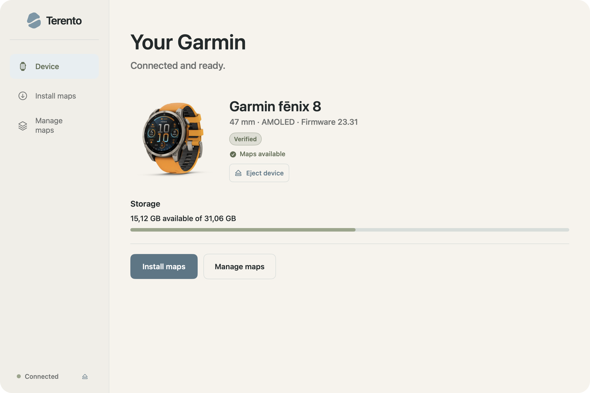
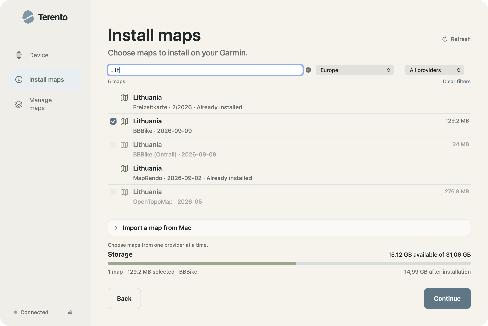
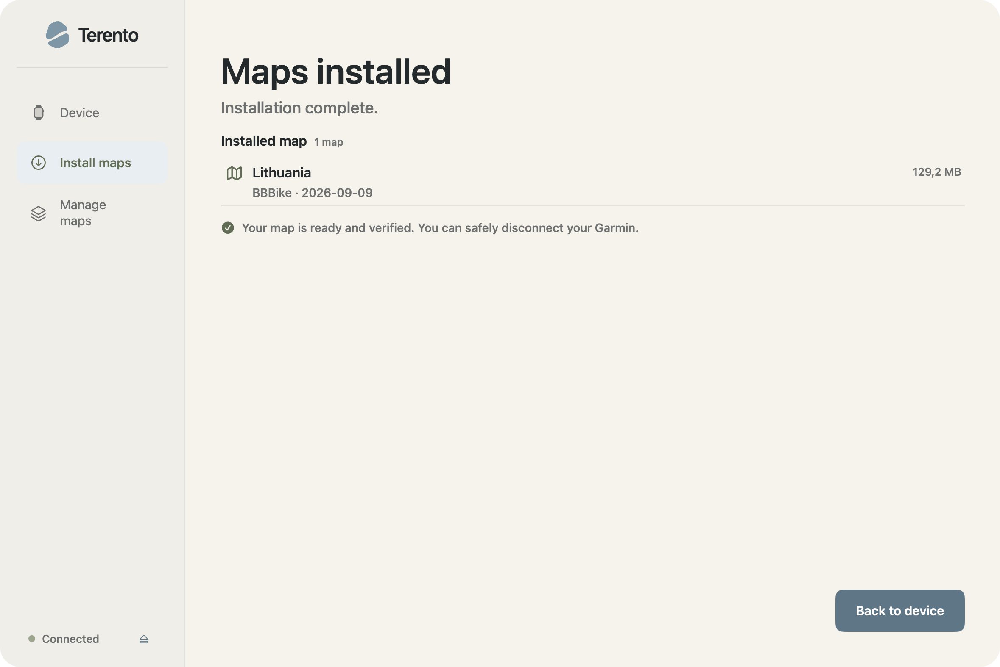
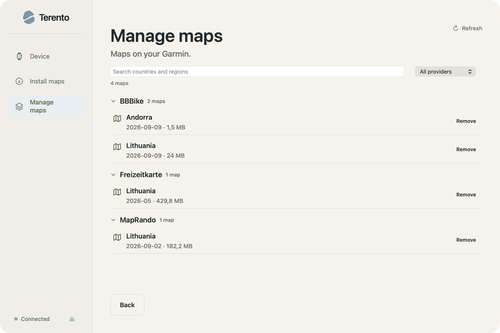

# Terento

> Install maps on Garmin watches, simply.

Get your Garmin ready for your next hike or ride. Connect your watch, choose a
map, and let Terento handle the download, installation, and transfer checks
from your Mac.

Terento is **free and open source**, built for Apple Silicon Macs and Garmin
smartwatches with map support. Choose from
[Freizeitkarte](https://www.freizeitkarte-osm.de/),
[OpenTopoMap](https://garmin.opentopomap.org/),
[MapRando](https://ravenfeld.gitlab.io/open-garmin-map/), and
[BBBike](https://garmin.bbbike.org), or import your own
compatible `.img` map.

**Connect → Install → Done**

**[Download for Mac](https://terento.app/download/?utm_source=github&utm_medium=referral&utm_campaign=repository&utm_content=readme_top_download)**
· [Check compatibility](https://terento.app/compatibility/?utm_source=github&utm_medium=referral&utm_campaign=repository&utm_content=readme_top_compatibility)
· [Mac installation guide](https://terento.app/guides/install-garmin-maps-mac/?utm_source=github&utm_medium=referral&utm_campaign=repository&utm_content=readme_top_guide)

**Public beta · macOS 13+ · Apple Silicon**

  

## Get the maps you need, with less setup

- **Find your destination.** Search countries and regions, filter by continent
  or provider, or import a compatible map from your Mac.
- **Install with confidence.** Terento checks available space, downloads from
  the original provider, and verifies the transfer to your watch.
- **Keep your maps organised.** See installed maps by provider, find available
  updates, and remove maps you no longer need.
- **Protect what is already there.** Original Garmin maps and unknown files
  remain protected. Updates replace only Terento-managed maps.

Removing a recognized third-party map that Terento did not install requires
separate confirmation.

## How it works

1. **Connect.** Plug in your watch with a USB data cable. Terento recognizes it
   and checks whether you can continue safely.
2. **Install.** Choose a region from the catalog or add your own compatible
   `.img` map. Terento handles the installation and verification.
3. **Done.** Wait for confirmation, safely disconnect your watch, and check
   that the map is available on it.

  

  

See map management

  

## Requirements and compatibility

- macOS 13 or later on an Apple Silicon Mac; Intel Macs are not supported.
- A Garmin smartwatch with map support.
- A USB cable that supports data transfer.
- An Internet connection for downloading catalog maps.

Compatibility is evaluated for each exact model and variant using real
installation evidence. The Compatibility page is a successful-installation
directory: it shows exact Garmin models and variants with at least one
successful shared installation. The list grows as more successful
installations are shared, and a model missing from the list does not mean it
is unsupported. Terento is intended for Garmin smartwatches with map support.

**[Check your watch's compatibility](https://terento.app/compatibility/?utm_source=github&utm_medium=referral&utm_campaign=repository&utm_content=readme_compatibility)**

Evidence for one model does not establish compatibility with every Garmin
watch. Handheld GPS devices, Edge cycling computers, and automotive devices
are outside the current public scope.

## Download and beta status

The latest public release is **beta.12 (build 32)**. The macOS app is notarized
and does not require Homebrew.

Beta.12 adds BBBike and BBBike (Ontrail) maps, continent filtering, clearer
country and region names, a larger catalog window, faster Install Maps
filtering, and filters in Manage Maps. Earlier beta.12 builds improved watch
model and screen identification and fixed map activity diagnostics that could
stay queued.

**[Download Terento](https://terento.app/download/?utm_source=github&utm_medium=referral&utm_campaign=repository&utm_content=readme_download)**

DMG, ZIP, release notes, and previous versions are available on
[GitHub Releases](https://github.com/VooZ2/terento/releases).

Terento remains a **Public beta — RC evaluation**. The owner-reported BBBike
Lithuania safe update is PASS, while the beta exit gate still requires one real
update to a newer map release for Freizeitkarte and one for OpenTopoMap.
MapRando and BBBike remain subject to provider-specific lifecycle evidence, and
compatibility claims remain exact-model and variant specific.

During an update, Terento verifies the replacement before removing the
previous Terento-owned version. If there is not enough space for both, it
stops and keeps the working map; no persistent local map backup is created.
Bugs are still possible during the beta.
Some watches may need to be reconnected if detection or map listing stalls.

## Maps

The current catalog includes main-map packages from
[Freizeitkarte](https://www.freizeitkarte-osm.de/),
[OpenTopoMap](https://garmin.opentopomap.org/),
[MapRando](https://ravenfeld.gitlab.io/open-garmin-map/), and
[BBBike](https://garmin.bbbike.org), based on OpenStreetMap data.
BBBike offers two map choices: BBBike and the smaller BBBike (Ontrail)
packages for hiking and cycling. The catalog includes its ready-made Garmin
regional packages in latin1 format.
Maps download from each provider's original infrastructure; Terento does not
host, mirror, or repackage them.

- Multiple maps from one provider can be installed in one operation;
  mixed-provider batches are not supported.
- MapRando publishes direct daily Garmin IMG packages; Terento downloads them
  from the provider's original source and does not host or repackage binaries.
- OpenTopoMap contour lines are an optional add-on. Choose whether to include
  them when installing a region in Terento; the main map works without them.
- Compatible local `.img` maps can be imported, but have no automatic provider
  update path.
- The validated catalog remains visible, but downloads and updates for Russia
  and Crimea are withheld under Terento's acquisition policy. Existing maps
  are not automatically removed.

## Privacy

No account or cloud device profile is required.

Two privacy-minimised diagnostic streams are enabled by default: compatibility
installation results and map-usage outcomes. You can turn either off in
`Terento → Diagnostics` without affecting installation. Custom map imports
contribute only to compatibility diagnostics, never map-usage diagnostics.

Reports exclude Garmin Unit IDs, serial numbers, accounts, local file paths,
map files, and raw diagnostic logs. Infrastructure partners may process IP
addresses and request metadata. Uploaded reports cannot be deleted from the app.

See the [Privacy Policy](https://terento.app/privacy/?utm_source=github&utm_medium=referral&utm_campaign=repository&utm_content=readme_privacy)
for report fields, retention, and privacy-rights requests.

## Why I built Terento

I enjoy mountain hiking, and before a trip I like to get maps for the places
I'm visiting onto my Garmin. Finding the maps and the right Mac software was
often harder than it should have been. Terento grew out of wanting that to
feel simple. I'm keeping it free and open source so it can help the community.

[Read the story](https://terento.app/about/?utm_source=github&utm_medium=referral&utm_campaign=repository&utm_content=readme_about)
· [Support Terento](https://buymeacoffee.com/vooz2)

Donations are optional and do not unlock features, maps, or provider access.

## Help make the beta better

If installation fails, Terento offers to open a GitHub issue with the
diagnostic information needed to investigate. You can also
[open an issue](https://github.com/VooZ2/terento/issues) directly.

Include your exact watch model and variant, Terento version, what you tried,
and what happened. A report that a map installed and works on your watch is
useful too.

For connection or map-visibility problems, see the
[Mac installation guide](https://terento.app/guides/install-garmin-maps-mac/?utm_source=github&utm_medium=referral&utm_campaign=repository&utm_content=readme_help_guide).

## Contributing

Bug reports, compatibility testing, documentation improvements, and focused
pull requests are welcome. The production app is a native Xcode macOS project
that uses the repository's SwiftPM source module.

- [Contributing](CONTRIBUTING.md) — development setup, test suites, and safe device testing.
- [Brand guidelines](brand/BRAND_GUIDELINES.md) — visual and user-facing rules.
- [Security](SECURITY.md) — reporting security issues.
- [Packaging](Packaging/README.md) — build, signing, and release details.

## Repository structure

Terento stays in one monorepo:

| Directory | Purpose |
| --- | --- |
| `app/Terento/` | Native macOS shell, resources, entitlements and app configuration |
| `app/TerentoCore/` | SwiftPM core, libmtp bridge, map/device logic and native tests |
| `backend/catalog-api/` | Catalog, device metadata, compatibility evidence, diagnostics and admin API |
| `site/` | Public website and localized pages |
| [`contracts/`](contracts/README.md) | Shared public API schemas and cross-language fixtures |
| `Tests/` | Repository test runners and cross-component contract checks |
| `Packaging/` | macOS build, validation, signing and release tooling |
| `site-deploy/` | Public website container configuration |

See [PROJECT_STRUCTURE.md](PROJECT_STRUCTURE.md) for the detailed repository map.

## License and attribution

Terento source code is licensed under [GPL-3.0-or-later](LICENSE).
[Third-party notices](THIRD_PARTY_NOTICES.md) cover bundled dependencies;
provider maps and [OpenStreetMap data](https://www.openstreetmap.org/copyright)
retain their own licenses and attribution.

Terento is an independent open-source project and is not affiliated with,
endorsed by, or sponsored by Garmin.

MapRando cards note that some map labels are in French in all six website
locales. Provider cards retain scrolling and navigation controls with the
horizontal scrollbar hidden.
