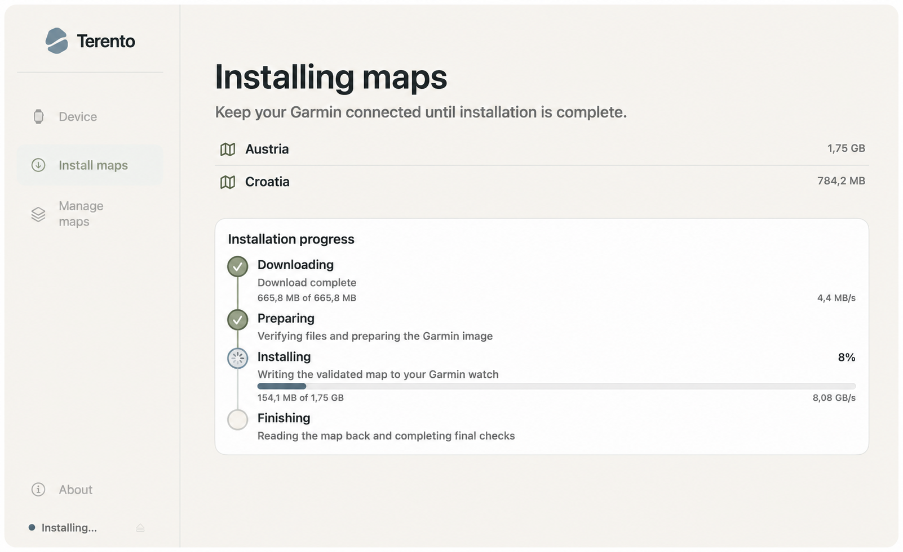

# Terento

> Your device, ready for where you're going.

[](https://github.com/VooZ2/terento/actions/workflows/swift-ci.yml) [](LICENSE)

Terento is a free, open-source native macOS app that makes community maps
easier to install and manage on Garmin smartwatches. It is designed around an
outcome rather than a transfer process:

```text
Connect → Choose → Ready
```

You should not need to understand MTP, `.img` files, Garmin filesystem paths,
or legacy transfer tools to get a map onto your watch.

<p align="center">
  
</p>

<p align="center"><em>Early preview of Terento's native macOS app.</em></p>

<p align="center">
  <a href="https://terento.app/">Visit terento.app</a> ·
  <a href="https://github.com/VooZ2/terento/releases">View releases</a> ·
  <a href="https://github.com/VooZ2/terento/issues">Report an issue</a>
</p>

> **Beta / pre-MVP:** Compatibility is still being validated on real
> hardware. The current validation profile is one Garmin smartwatch. This is
> not a claim of universal Garmin support.

## What Terento does

- detects and identifies a connected Garmin smartwatch;
- discovers existing maps and compares available metadata;
- downloads Freizeitkarte packages directly to your Mac from the original
  provider;
- validates the package, map image, storage, transfer, and read-back result;
- records local ownership state for maps installed by Terento; and
- keeps unknown, Garmin-owned, and user-managed files read-only.

## Why Terento

- **Native macOS experience** — built as a SwiftUI application for Apple
  Silicon Macs.
- **Outcome-first UX** — connect your watch, choose a region, and follow a
  clear result.
- **Safe by default** — Terento modifies only files it can prove it owns.
- **Local-first privacy** — no account, cloud device profile, or server-side
  Garmin Unit ID storage during MVP.

## Requirements

- macOS 13 or newer;
- Apple Silicon Mac (`arm64`);
- a Garmin smartwatch using a connectivity path currently under validation; and
- an internet connection to resolve catalog metadata and download a map from
  Freizeitkarte.

Homebrew is not required by the packaged native app. It is used only by
contributors for the legacy SwiftPM development build and regression tests,
where it provides local development copies of `libmtp` and `libusb`.

## Current compatibility

| Area | Status |
| --- | --- |
| macOS | macOS 13 or newer |
| Mac architecture | Apple Silicon / `arm64` |
| Map provider | Freizeitkarte only |
| Garmin smartwatch | Hardware validation is limited to one device and one tested path; public support is not yet declared |
| Garmin handheld, Edge, automotive, and non-Garmin devices | Outside the current scope |

One successful test on one smartwatch is evidence for that exact device,
firmware, and tested path only. It must not be generalized to other Garmin
devices or map regions.

## Map provider and attribution

Freizeitkarte is the only map provider in this phase. Map binaries are
downloaded from the original provider infrastructure to the user's Mac;
Terento does not host, mirror, proxy, or repackage map files during MVP.

Provider attribution and data licenses remain separate from the Terento source
license. See [Freizeitkarte](https://www.freizeitkarte-osm.de/) and
[OpenStreetMap copyright](https://www.openstreetmap.org/copyright).

## Safety and privacy

Terento prefers a safe failure over destructive guessing. Unknown files are
not silently replaced, renamed, or removed. Destructive lifecycle actions are
limited to maps Terento can prove it owns through its local manifest and exact
device-object checks.

Device state, downloaded packages, ownership manifests, and diagnostics remain
local to the Mac during MVP. Terento is not affiliated with, endorsed by, or
sponsored by Garmin.

## Beta status

Terento is not a stable production release. The current native macOS target
and bundled arm64 runtime are being validated locally. Safe Update is covered
by automated validation, but its final real-device gate is waiting for a
genuinely newer Freizeitkarte release.

### Download the beta

Apple Silicon users can install the notarized beta from the GitHub release:

- [Download DMG](https://github.com/VooZ2/terento/releases/download/v1.0.0-beta.3/Terento-1.0.0-beta.3-macOS-arm64.dmg) — drag Terento to Applications
- [Download ZIP](https://github.com/VooZ2/terento/releases/download/v1.0.0-beta.3/Terento-1.0.0-beta.3-macOS-arm64.zip) — open the contained app

This is a pre-MVP beta with limited real-device validation. Read the
[release notes](RELEASE_NOTES.md) before installing. Generated local outputs
remain outside the repository under the ignored `dist/` directory.

## Build from source

The production app is an Xcode macOS application target. Development
prerequisites, SwiftPM commands, safe hardware testing rules, and release
packaging instructions are documented here:

- [`CONTRIBUTING.md`](CONTRIBUTING.md) — development setup and safe testing
- [`Packaging/README.md`](Packaging/README.md) — local release validation
- [`lab/native-connectivity-poc/README.md`](lab/native-connectivity-poc/README.md)
  — SwiftPM source module and regression harness

The main project is [`Terento.xcodeproj`](Terento.xcodeproj).

## Repository guide

- [`app/`](app/) — native macOS application shell, entitlements, and resources
- [`lab/native-connectivity-poc/`](lab/native-connectivity-poc/) — SwiftPM
  source module and tests consumed by the app target
- [`Packaging/`](Packaging/) — local build, signing, and notarization scripts
- [`backend/catalog-api/`](backend/catalog-api/) — metadata-only catalog service
- [`internal/ARCHITECTURE.md`](internal/ARCHITECTURE.md) — current technical
  boundaries and architecture decisions
- [`THIRD_PARTY_NOTICES.md`](THIRD_PARTY_NOTICES.md) — dependency and runtime
  notices
- [`RELEASE_NOTES.md`](RELEASE_NOTES.md) — beta checkpoint scope and limits

## Contributing and support

Bug reports, documentation improvements, careful testing, and focused pull
requests are welcome. Please read [`CONTRIBUTING.md`](CONTRIBUTING.md) before
working with a real device.

For security issues, follow [`SECURITY.md`](SECURITY.md) instead of opening a
public issue.

## License

Terento source code is licensed under
[GPL-3.0-or-later](LICENSE). See [NOTICE](NOTICE) for attribution and provider
map licensing information.
