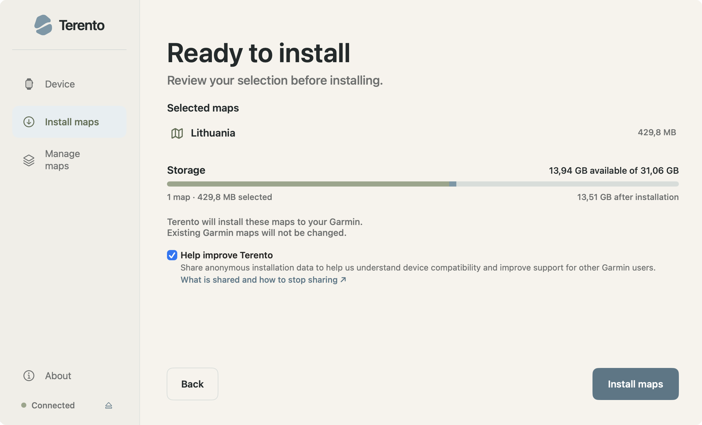
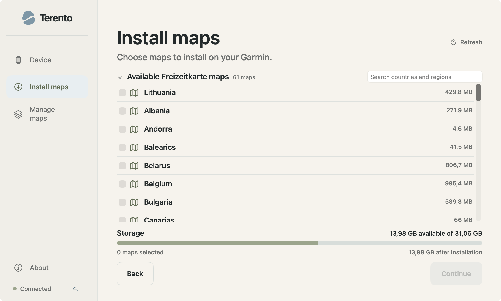
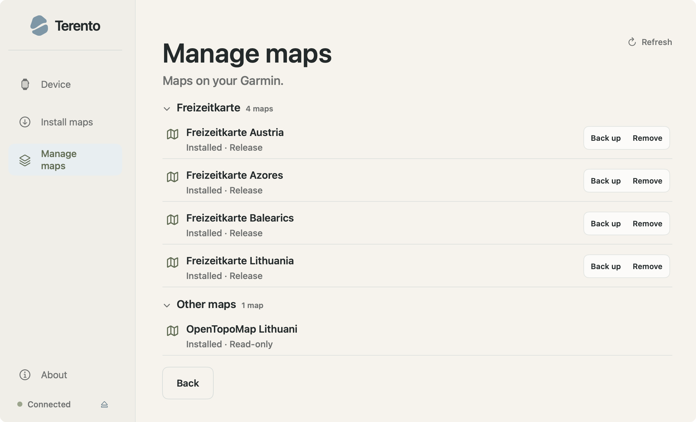

# Terento

> A simple way to get maps onto your Garmin smartwatch from a Mac.

Terento is a free, open-source native macOS app for installing and managing
Freizeitkarte maps on Garmin smartwatches.

I started it because I got tired of looking for the right software every time
I wanted to put maps on my Garmin from a Mac. I wanted something simpler:

**Connect your watch → choose a map → install it.**

No extra transfer tools, no digging through folders, and no need to know how
Garmin stores its map files.

  

  <em>Review your map, storage, and installation choice before installing.</em>

  <a href="https://terento.app/download/?utm_source=github&utm_medium=referral&utm_campaign=repository&utm_content=readme_top_download">Download the beta</a>
  ·
  <a href="https://terento.app/compatibility/?utm_source=github&utm_medium=referral&utm_campaign=repository&utm_content=readme_top_compatibility">Check compatibility</a>
  ·
  <a href="https://github.com/VooZ2/terento/issues">Report an issue</a>
  ·
  <a href="https://terento.app/?utm_source=github&utm_medium=referral&utm_campaign=repository&utm_content=readme_top_website">Website</a>

> **Early beta:** Compatibility varies by Garmin smartwatch model. Terento's
> compatibility list is built from real installation reports and community
> testing.

## What it does

Terento keeps the process intentionally small:

- detects your connected Garmin smartwatch;
- shows the Freizeitkarte regions available to install;
- downloads maps from their original source;
- checks available storage before making changes;
- installs and verifies the map;
- lets you back up or remove maps installed by Terento; and
- leaves Garmin's own maps and other unknown files alone.

The complete Freizeitkarte catalog remains visible. Under Terento's current
acquisition policy, downloads and updates are not offered for russia or
Crimea; installed Terento-owned maps still retain safe backup and explicit
removal controls.

  
  

## Why Terento

Garmin watches are great outdoors. Getting third-party maps onto newer models
from macOS can be less straightforward.

Terento is my attempt to make that part feel like a normal Mac app instead of
a file-transfer exercise.

- **Native to macOS** — built for Apple Silicon.
- **Simple** — connect your watch, choose a region, and install.
- **Focused** — Terento does maps rather than trying to replace every Garmin tool.
- **Careful with your watch** — files Terento cannot identify as its own stay untouched.
- **Local-first** — no account or cloud device profile is required.
- **Open source** — the code, issues, and development are public.

## Compatibility

Garmin support is based on real device evidence rather than assuming every
watch behaves the same way.

You may see these statuses:

- **Testing** — the exact model has been recognized as map-capable, but no successful shared installation has been received yet.
- **Tested** — 1–2 successful shared installations.
- **Supported** — 3–4 successful shared installations.
- **Verified** — 5 or more successful shared installations.

See the current compatibility list:

**[terento.app/compatibility](https://terento.app/compatibility/?utm_source=github&utm_medium=referral&utm_campaign=repository&utm_content=readme_compatibility)**

If you own a Garmin model that is not there yet, testing it and sharing the
result is genuinely useful. Every report helps build a better picture of what
works.

## Requirements

- macOS 13 or later
- Apple Silicon Mac
- Garmin smartwatch with map support
- USB connection
- Internet connection for downloading maps

Freizeitkarte is the only map source supported in the current beta.

## Download

The easiest way to get the latest public beta is from:

**[Download Terento](https://terento.app/download/?utm_source=github&utm_medium=referral&utm_campaign=repository&utm_content=readme_download)**

The macOS app is notarized and does not require Homebrew.

DMG, ZIP, release notes, and previous versions are also available on
[GitHub Releases](https://github.com/VooZ2/terento/releases).

## A note about beta software

Terento writes map files to your watch, so this is one of those projects where
being careful matters.

There are safeguards around installation, replacement, and removal, and
Terento avoids changing files it cannot confidently identify. Still, this is
early beta software and bugs are possible.

If you are not comfortable testing early software with your Garmin, it is
better to wait for a later release.

## Privacy

Terento works without an account.

Before a new installation, you can choose whether to share privacy-minimised
installation results to help improve compatibility information for other
Garmin users. Sharing can be turned off and does not affect installation.

Reports do not include Garmin Unit IDs, serial numbers, accounts, file paths,
map files, or raw diagnostic logs.

Your maps, device files, and diagnostics stay on your Mac.

See the full
[Privacy Policy](https://terento.app/privacy/?utm_source=github&utm_medium=referral&utm_campaign=repository&utm_content=readme_privacy).

## Maps

Terento currently works with
[Freizeitkarte](https://www.freizeitkarte-osm.de/), which provides Garmin maps
based on OpenStreetMap data.

Maps are downloaded from the original Freizeitkarte infrastructure. Terento
does not host, mirror, or repackage them.

- [Freizeitkarte](https://www.freizeitkarte-osm.de/)
- [OpenStreetMap copyright](https://www.openstreetmap.org/copyright)

Terento is an independent open-source project and is not affiliated with,
endorsed by, or sponsored by Garmin.

## Feedback

This is still an early project, and feedback from real Garmin users is
especially valuable.

If you try Terento, I would love to know:

- which Garmin model you used;
- whether the watch was detected correctly; and
- whether the map installed successfully.

If something does not work, open a
[GitHub issue](https://github.com/VooZ2/terento/issues) and attach the
`log.txt` generated by Terento.

Even a simple **“worked on this model”** report helps.

## Contributing

Bug reports, compatibility testing, documentation improvements, and focused
pull requests are welcome.

Start with:

- [`CONTRIBUTING.md`](CONTRIBUTING.md) — development setup and safe device testing
- [`SECURITY.md`](SECURITY.md) — reporting security issues
- [`Packaging/README.md`](Packaging/README.md) — build, signing, and release details

The production app is a native Xcode macOS project. Development and regression
tests live alongside it in the repository.

## License

Terento source code is licensed under [GPL-3.0-or-later](LICENSE).
